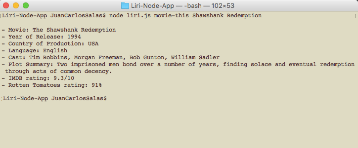
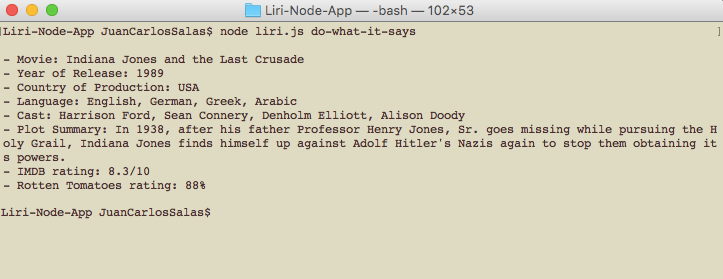

# Liri-Node-App - Juan Carlos Salas
## Coding Bootcamp - Asignment 10

This application is comprised of several APIs and node packages to provide you with specific information about films, concerts, and music. 

For this app to work correctly, you'll need to install the NPM modules, including file-system, node-spotify-api and momentjs as well as getting your own [Spotify API ID.](https://developer.spotify.com/). 

There are four various commands you can use in terminal to trigger the Liri Node App: `concert-this`, `spotify-this-song`, `movie-this`, and `do-what-it-says`.
 

##### `1. node liri.js concert-this <artist/band name>`

This command will search the bandsintown API to search for the next concert if your band or artists. It will you provide you with the name of the arist or band you searched, the **venue** of their next concert, the **date** of the concert, and the **location** of the venue.

But if your artist or band doesn't have any upcoming concerts, you'll get a message saying so.

And if you were ot forget to input and artist or band, you'll get a reponse stating the error.

 

#### `2. node liri.js movie-this <movie name>`

This command uses the OMDB API to provide you with information on the movie you searched. The return information will provide you with:

* Title
* Year of Release
* Country of Production
* Language
* Cast
* Plot Summary
* IMDB Rating (If Applicable)
* Rotten Tomatoes Rating (If Applicable)

If you don't submit a movie name when you enter the command, the results will default to the film Mr. Nobody.

#### `3. node liri.js spotify-this-song <song name here>`

This command uses the Spotify API to provide information on the song you input. If there are multiple songs with the same title, it will chose the most recent song in order of release. You will be given the **track name**, **album**, and **artist** as well as a **link** to a sample, if applicable.

If no song is sumbitted, the results will default to *The Sign* by Ace of Base

#### `4. node liri.js do-what-it-says`

This last command utilizes the `random.txt` file that is saved in this app. I will grab the string in the file, and use those commands to return the appropriate information. By default the file reads `spotify-this-song,I Want It That Way`. Therefore if you run this app with this code, it will return you the the track information, using the Spotify API, of the song *I Want It That Way*.

This is meant to be executed with any other of the aforemention commands. So, if you were to change `spotify-this-song` to `movie-this`, and `I Want It That Way` to `Indiana Jones and the Last Crusade` and run the code, it will return information about the movie.

### **BONUS FEATURE**

You will notice that when you first run the app the first time, a new .txt files called log.txt will be created. This file will contain the comman line you recently ran in the terminal. Additionally, any commands you pass will be logged in this file and will the existing content will not be overwritten.

